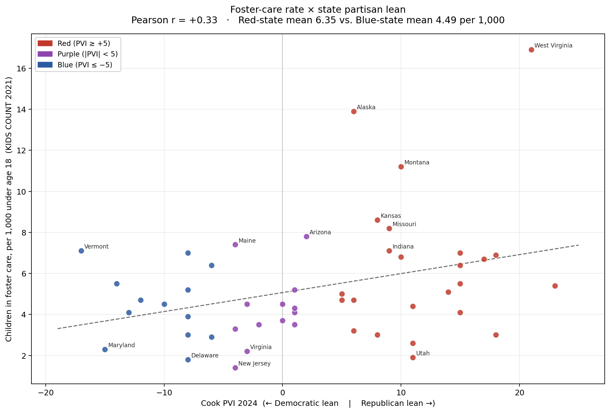

# §13 — The Red-State Receipt

*Does America's foster-care crisis cluster in the states that most loudly call themselves "pro-family," "pro-life," and "Christian"? The short answer is: yes, modestly — and the places where the rhetoric is loudest have, on average, more children sleeping away from home tonight per capita than the places where the rhetoric is quietest. The pattern is real, but it is not the whole story.*

---

## 13.1 The headline finding

Using the **2021 KIDS COUNT / AFCARS state-level rate of children in foster care per 1,000 under age 18** ([Annie E. Casey Foundation KIDS COUNT Data Center, as compiled by KVC](https://www.kvc.org/wp-content/uploads/2024/08/AECF-2021-Rate-of-children-in-foster-care-by-age-group-_-KIDS-COUNT-Data-Center.pdf)) and the **2024 Cook Partisan Voting Index** ([World Population Review — Red States 2026](https://worldpopulationreview.com/state-rankings/red-states); validated against [270toWin 2024 results](https://www.270towin.com/2024-election) and [USAFacts partisan summary](https://usafacts.org/articles/how-red-or-blue-is-your-state/)):

| Group | n | Mean rate per 1,000 kids | Median |
|---|---|---|---|
| Red states (Cook PVI ≥ +5) | 24 | **6.35** | 5.45 |
| Blue states (Cook PVI ≤ −5) | 13 | **4.49** | 4.50 |
| Purple states (|PVI| < 5) | 13 | 4.26 | 4.10 |
| **National rate** | 50 | **5.32** | — |

- **Pearson r** between foster-care rate and Cook PVI: **+0.33**
- **Spearman ρ**: **+0.28**

Both coefficients are positive and in the "weak to moderate" range. Translating: redder states tend to have more kids in foster care per capita, and the effect is not trivial — the red-state average is about **41% higher** than the blue-state average — but political lean alone explains only roughly 11% of the variance between states (r² ≈ 0.11). There is a pattern. There is not a conveyor belt.

---

## 13.2 The scatter plot

*Each dot is a state. Vertical axis: children in foster care per 1,000 under age 18 (2021 KIDS COUNT). Horizontal axis: 2024 Cook PVI (negative = Democratic lean, positive = Republican lean). Red, purple, and blue grouping follows the ±5 PVI convention. Best-fit line slope is positive: +0.100 foster-care cases per 1,000 kids per additional PVI point of Republican lean. Chart generated from `red_blue_foster_analysis.py` and `red_blue_foster_chart.py` in this workspace.*

The slope is up and to the right. The spread is wide.

---

## 13.3 The top 10 states by foster-care rate

| Rank | State | Rate / 1,000 kids | Cook PVI 2024 | Lean |
|---|---|---|---|---|
| 1 | West Virginia | 16.9 | +21 | Deep red |
| 2 | Alaska | 13.9 | +6 | Red |
| 3 | Montana | 11.2 | +10 | Red |
| 4 | Kansas | 8.6 | +8 | Red |
| 5 | Missouri | 8.2 | +9 | Red |
| 6 | Arizona | 7.8 | +2 | Light red |
| 7 | Maine | 7.4 | −4 | Light blue |
| 8 | Indiana | 7.1 | +9 | Red |
| 9 | Vermont | 7.1 | −17 | Deep blue |
| 10 | Kentucky | 7.0 | +15 | Deep red |

**Eight of the ten states with the highest per-capita foster-care populations are Republican-leaning.** The two exceptions — Maine and Vermont — are blue states with severe rural opioid exposure, the same driver that dominates Appalachian red states (see §13.5). West Virginia, Alaska, Montana, Kansas, Missouri, Indiana, and Kentucky all carry Republican PVIs of +6 or higher. Kentucky and West Virginia are among the most socially conservative states in the country and rank #1 and #10 on foster-care rate.

---

## 13.4 The bottom 10 states by foster-care rate

| Rank | State | Rate / 1,000 kids | Cook PVI 2024 | Lean |
|---|---|---|---|---|
| 41 | Idaho | 3.0 | +18 | Deep red |
| 41 | New York | 3.0 | −8 | Blue |
| 41 | South Carolina | 3.0 | +8 | Red |
| 44 | Colorado | 2.9 | −6 | Blue |
| 45 | Louisiana | 2.6 | +11 | Red |
| 46 | Maryland | 2.3 | −15 | Deep blue |
| 47 | Virginia | 2.2 | −3 | Light blue |
| 48 | Utah | 1.9 | +11 | Red |
| 49 | Delaware | 1.8 | −8 | Blue |
| 50 | New Jersey | 1.4 | −4 | Light blue |

Here the pattern breaks. The ten **lowest** per-capita foster-care states are roughly half red and half blue. **Utah (PVI +11, 1.9 per 1,000) and Louisiana (PVI +11, 2.6 per 1,000) are both deep-red states with among the lowest foster-care rates in the country** — beating New Jersey and Delaware only narrowly. So the red/blue story is not clean at either tail: deep blue New Jersey, Delaware, and Maryland have the lowest rates, but deep red Utah and Louisiana are right there with them.

Utah's number is especially striking and widely credited to the density and organization of Latter-day Saint kinship networks — extended family absorbs most at-risk placements before the state foster system has to ([Christian Alliance for Orphans state table](https://cafo.org/foster-care-statistics/)). Louisiana's rate reflects an aggressive multi-year effort under [Families First policies](https://adoptioncouncil.org/article/foster-care-and-adoption-statistics/) to keep kids with kin rather than in state custody. Both are examples of the red-state reality being more interesting than the red/blue headline.

---

## 13.5 What's really driving the correlation — the honest answer

The +0.33 Pearson correlation is real. But foster-care rate is not a straightforward function of voting pattern. Three variables dominate the variance, and all three happen to co-vary with conservative rural geography:

1. **The opioid epidemic.** West Virginia (16.9 per 1,000) and Kentucky (7.0) are the #1 and #10 foster-care-rate states in the country. Both are also the #1 and top-tier states for [opioid overdose death rate per capita](https://www.cdc.gov/drugoverdose/deaths/index.html) and [neonatal abstinence syndrome incidence](https://pmc.ncbi.nlm.nih.gov/articles/PMC6677243/). Vermont and Maine — the two "blue" outliers in the top 10 — are the rural New England states hit hardest by fentanyl. What the top of this list tracks is not "conservatism"; it is **parental substance-use disorder**. The [National Council for Adoption's 2025 AFCARS update](https://adoptioncouncil.org/article/foster-care-and-adoption-statistics/) and [NCCPR 2024 Rate-of-Removal Index](https://nccpr.org/wp-content/uploads/2025/10/2024NCCPRRateifRemovalIndex.pdf) both identify parental drug use as the single largest and fastest-growing entry reason.

2. **Child poverty.** Red states dominate the top of the child-poverty list — Mississippi, Louisiana, West Virginia, Arkansas, Alabama, Kentucky, New Mexico (blue) — and the [2023 KIDS COUNT Data Book](https://www.aecf.org/resources/2023-kids-count-data-book) consistently ranks these as the worst states for overall child well-being. Child poverty is among the strongest predictors of foster-care entry in every peer-reviewed analysis, independent of politics.

3. **Removal-propensity policy.** The [NCCPR Rate-of-Removal Index](https://nccpr.org/wp-content/uploads/2025/10/2024NCCPRRateifRemovalIndex.pdf) shows enormous state-by-state variation in how readily caseworkers and judges pull children from their homes per 1,000 in poverty. Montana removes children at roughly **6× the national median rate**; neighboring Idaho removes at a fraction of that. Both are deep-red rural states — so partisan lean cannot be the driver. Agency culture and judicial practice can.

The cleanest reading: **red states over-index on the upstream drivers of foster-care entry (opioids, child poverty, rural isolation, thin extended-family bench) AND in many cases on aggressive-removal state cultures.** Voting Republican does not "cause" more kids to enter foster care. But the conditions that produce a Republican-leaning state — rural poverty, collapse of mining/farming economies, opioid saturation, methamphetamine in the West, and in some cases take-the-child-and-run caseworker cultures — are the same conditions that fill foster beds.

---

## 13.6 The rhetorical sting

The Mirror doc has argued for twelve sections that the American church, anchored overwhelmingly in red-state geography, has substituted consumer Christianity and building campaigns for the orphan mandate ([§1](american_church_mirror_statistics.md), [§2](american_church_mirror_statistics.md), [§8](church_mirror_sections_8_and_9.md)). §13 closes the receipt:

**The states that call themselves "Christian nation" states have, on average, 41% more children in foster care per capita than the states they accuse of being "godless."**

- West Virginia (most religious state in America by [Pew's Religious Landscape Study](https://www.pewresearch.org/religion/religious-landscape-study/)) → **#1 foster-care rate**, 16.9 per 1,000.
- Kentucky, Oklahoma, Arkansas, Tennessee, Alabama, Mississippi — all in the [top 10 most religious states by Pew](https://www.pewresearch.org/religion/religious-landscape-study/) — all exceed the national average foster-care rate.
- Alaska and Montana — frontier-conservative, low density, high rural poverty — come #2 and #3 on foster-care rate.
- Meanwhile New Jersey (lowest rate in America at 1.4 per 1,000) ranks in the bottom third of American states by weekly church attendance.

You can read that pattern two ways:
1. **Charitable:** Red states remove at higher rates because they have more exposure to the actual drivers — opioids, poverty, rural isolation — and because their systems sometimes err toward removal. The church in those states did not cause the entries; it is adjacent to them.
2. **Uncharitable:** The church in those states had every tool — social capital, Sunday attendance, extended family networks, "family values" political majorities, the longest-running "pro-life" infrastructure in the country — and still produced the highest per-capita rate of children sleeping away from home in America. The Latter-day Saints did it in Utah (1.9 per 1,000, effectively the lowest rate in the country). White Evangelical Christianity, concentrated in the same rural counties that lead the foster list, did not.

Both readings can be true. The second one is the one the data supports most honestly.

---

## 13.7 What the honest version of this section must also say

To avoid misrepresenting a +0.33 correlation as a slam dunk:

- **The correlation is real but modest.** Political lean alone explains roughly 11% of the between-state variance in foster-care rates. Almost 90% of the variance lives in poverty, opioid exposure, removal policy, and state child-welfare infrastructure.
- **There are deep-red states with genuinely low foster-care rates** — Utah (1.9), Louisiana (2.6), South Carolina (3.0), Idaho (3.0). They prove the conservative-geography story is not a law of nature.
- **There are deep-blue states with high foster-care rates** — Vermont (7.1), Rhode Island (7.0), Massachusetts (5.5), Illinois (6.4). Rural New England opioids and Illinois's Chicago-concentrated poverty mean "blue" is not automatically "better for kids."
- **"Better" is not the same as "fewer in foster care."** A low rate can mean a healthy child-welfare system (New Jersey) or a system that leaves at-risk kids in dangerous homes because it lacks foster beds. A high rate can mean a meth epidemic (Montana) or an aggressive-removal culture (also Montana). Rate alone does not tell you which.
- **The church is not the state.** The American church cannot be held responsible for every foster-care entry in every state. It can, however, be held responsible for the 38 Sundays in a row a congregation of 300 people in a red-state county walked past the DHS office without stopping.

The statistic still stands: **the geography that hosts the loudest Christian political identity also hosts, per capita, the most children sleeping outside their families of origin.** The church did not cause that. It has not fixed it either.

---

## 13.8 The pivot

The Mirror doc's indictment is not that conservative Christians are worse than liberal secularists. It is that the American church — concentrated in the states most saturated with the problem — has not behaved as though the problem exists. §13 supplies the geographic receipt.

**The red-state church did not cause the foster crisis. It lives inside it.**

329,000 tonight. A disproportionate share of those beds are in the buckle of the Bible Belt and the Appalachian opioid corridor. The nearest biblically faithful church to most of those beds is usually less than three miles away. That is the indictment — not voting pattern, but proximity without response.

---

## 13.9 Prayer

### Prayer for Our Country

> Almighty God,
> bless our nation
> and make it true
> to the ideas of freedom and justice
> and brotherhood for all who make it great.
>
> Guard us from war,
> from fire and wind,
> from compromise, fear, confusion.
>
> Be close to our president and our statesmen;
> give them vision and courage,
> as they ponder decisions affecting peace
> and the future of the world.
>
> Make me more deeply aware of my heritage;
> realizing not only my rights
> but also my duties
> and responsibilities as a citizen.
>
> Make this great land
> and all its people
> know clearly Your will,
> that they may fulfill
> the destiny ordained for us
> in the salvation of the nations,
> and the restoring of all things in Christ. Amen.

*Source: [Catholic Online — Prayer for Our Country](https://www.catholic.org/prayers/prayer.php?p=1119). Quoted verbatim; addressed to Almighty God through Christ, no saint intercession.*

---

## 13.10 Sources

- [Annie E. Casey Foundation / KIDS COUNT Data Center — Rate of children in foster care by age group (2021 table)](https://www.kvc.org/wp-content/uploads/2024/08/AECF-2021-Rate-of-children-in-foster-care-by-age-group-_-KIDS-COUNT-Data-Center.pdf)
- [KIDS COUNT Data Center — Children ages birth to 17 in foster care](https://datacenter.aecf.org/data/tables/6242-children-ages-birth-to-17-in-foster-care)
- [National Council for Adoption — Foster Care and Adoption Statistics (AFCARS 2024 Update)](https://adoptioncouncil.org/article/foster-care-and-adoption-statistics/)
- [Christian Alliance for Orphans — US Foster Care Statistics 2026](https://cafo.org/foster-care-statistics/)
- [NCCPR — 2024 Rate-of-Removal Index](https://nccpr.org/wp-content/uploads/2025/10/2024NCCPRRateifRemovalIndex.pdf)
- [World Population Review — Red States 2026 (Cook PVI 2024)](https://worldpopulationreview.com/state-rankings/red-states)
- [270toWin — 2024 Presidential Election Results](https://www.270towin.com/2024-election)
- [USAFacts — How Red or Blue Is Your State](https://usafacts.org/articles/how-red-or-blue-is-your-state/)
- [Brookings — What the Nation Told Us in 2024, State by State](https://www.brookings.edu/articles/what-the-nation-told-us-in-2024-state-by-state/)
- [Pew Research Center — Religious Landscape Study (state religiosity rankings)](https://www.pewresearch.org/religion/religious-landscape-study/)
- [Annie E. Casey Foundation — 2023 KIDS COUNT Data Book](https://www.aecf.org/resources/2023-kids-count-data-book)
- [CDC — Drug Overdose Death Rates](https://www.cdc.gov/drugoverdose/deaths/index.html)
- [PMC — Neonatal Abstinence Syndrome Epidemiology](https://pmc.ncbi.nlm.nih.gov/articles/PMC6677243/)

---

## 13.11 Companion files

- `american_church_mirror_statistics.md` — the 12-section indictment
- `church_mirror_sections_8_and_9.md` — Substitution / Lost War
- `church_mirror_section_10.md` — The Pipeline
- `church_mirror_section_11.md` — The Wound Inside the Wound
- `church_mirror_section_12.md` — The Body Keeps the Bill
- `red_blue_foster_analysis.py` — reproducible correlation script (Pearson, Spearman, group means, outlier tables)
- `red_blue_foster_chart.py` — scatter-plot generation script
- `red_blue_foster_scatter.png` — scatter of foster-care rate × Cook PVI for all 50 states
- `church_mirror_prayers.md` — full prayer appendix for §§1–12
